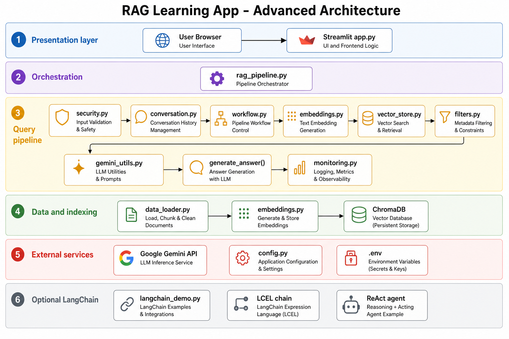

# RAG Learning App

A Retrieval-Augmented Generation (RAG) application built with Python, ChromaDB, SentenceTransformers, and Google Gemini. You'll build this incrementally over Weeks 10–18.

## What This App Does

You can ask this app questions about Python, machine learning, databases, APIs, and AI concepts. It finds the most relevant documents from its knowledge base and sends them to Gemini as context — so the answers are grounded in real information rather than guesswork.

## System Architecture

See **[ARCHITECTURE.md](ARCHITECTURE.md)** for the full Week 16 diagram and component explanations.



**Quick reference — query flow:**

```
User Query
    │
    ▼
[security.py]      ← Validate and sanitize input (Week 12)
    │
    ▼
[compliance.py]    ← Tag metadata and redact sensitive data (Week 18)
    │
    ▼
[workflow.py]      ← Rewrite query for better retrieval (Week 15)
    │
    ▼
[embeddings.py]    ← Convert query to a vector
    │
    ▼
[vector_store.py]  ← Find similar document vectors in ChromaDB
    │
    ▼
[filters.py]       ← Remove irrelevant results (Week 14)
    │
    ▼
[rag_pipeline.py]  ← Build prompt with retrieved context
    │
    ▼
  Gemini API       ← Generate answer
    │
    ▼
[monitoring.py]    ← Check for hallucinations (Week 13)
    │
    ▼
[app.py]           ← Display answer, sources, confidence
```

## Setup

### 1. Clone the repository
```bash
git clone <repo-url>
cd student-rag-project
```

### 2. Create a virtual environment
```bash
python -m venv venv
```

Activate it:
- **Mac/Linux:** `source venv/bin/activate`
- **Windows:** `venv\Scripts\activate`

### 3. Install dependencies
```bash
pip install -r requirements.txt
```

### 4. Set up your Gemini API key

Copy the example environment file:
```bash
cp .env.example .env
```

Open `.env` and replace `your-gemini-api-key-here` with your actual key.
Get a free key at: https://aistudio.google.com/apikey

### 5. Run the app
```bash
streamlit run app.py
```

The app opens in your browser at `http://localhost:8501`.

---

## File Descriptions

| File | Purpose |
|------|---------|
| `app.py` | Streamlit web interface |
| `config.py` | Configuration constants |
| `embeddings.py` | Convert text to vector embeddings |
| `vector_store.py` | Store and search vectors with ChromaDB |
| `data_loader.py` | Sample tech documents |
| `rag_pipeline.py` | Central orchestration — ties everything together |
| `langchain_engine.py` | LangChain engine (Chroma, embeddings, Gemini, LCEL / ReAct) |
| `conversation.py` | Conversation history (Week 11) |
| `security.py` | Input validation, injection defense, and data protection (Weeks 12 & 17) |
| `compliance.py` | Metadata tagging and log redaction for sensitive data (Week 18) |
| `monitoring.py` | Hallucination detection (Week 13) |
| `filters.py` | Similarity filtering and fallbacks (Week 14) |
| `workflow.py` | Query rewriting and multi-hop retrieval (Week 15) |
| `langchain_demo.py` | CLI test runner for the LangChain-backed `run_rag()` |
| `LANGCHAIN.md` | LangChain architecture and configuration |
| `ARCHITECTURE.md` | High-level architecture diagram and explanation (Week 16) |
| `docs/` | Architecture diagram PNG and editable Excalidraw file |

### LangChain pipeline

LangChain powers the main app (`langchain_engine.py` + `rag_pipeline.py`).

```bash
pip install -r requirements.txt
streamlit run app.py
```

Optional CLI test:

```bash
python langchain_demo.py "What is Python?"
```

Set `RAG_MODE=react` in `.env` for the ReAct agent. See [LANGCHAIN.md](LANGCHAIN.md).

---

## Week 18 — Compliance (Metadata Tagging & Redaction)

This section documents how the app handles sensitive data responsibly. This is **compliance-aware design**, not a SOC 2 certification.

### Applicable trust principles (hypothetical use case)

Our RAG app answers questions about public tech documentation. If deployed commercially, these SOC 2-style principles would apply:

| Principle | Why it applies |
|-----------|----------------|
| **Security** | User queries reach an external LLM API and are embedded into a vector store. Access to API keys, session chat history, and ChromaDB must be protected. |
| **Confidentiality** | Users might paste emails, account numbers, or API keys into chat even though the app is for tech Q&A. Those values must not appear in logs or debug output. |
| **Privacy** | Personal identifiers (PII) and health-related text (PHI) should be blocked at input and never stored in analytics or error traces. |

### Where sensitive data could appear

| Location | Risk | Control |
|----------|------|---------|
| **User chat input** | PII, secrets, PHI pasted into the prompt | `security.py` blocks known patterns; `compliance.py` tags and redacts before logging |
| **Knowledge-base documents** | Hypothetically could contain internal/confidential docs | Sample corpus is public educational text; ingest tags each chunk as `public` / `operational` |
| **Retrieved vector chunks** | Could surface sensitive text if corpus were compromised | Each retrieved chunk re-tagged at retrieval time |
| **Model output** | LLM might echo sensitive input | Output tagged; logs use redacted text only |
| **Error messages** | Exceptions may include user text | `filters.handle_api_error()` redacts before display |
| **Session state / chat UI** | Conversation stored in Streamlit session | User sees their own input; compliance metadata shown without raw log dumps |

### Metadata tagging scheme

Every tagged item carries three dimensions:

| Field | Values | Purpose |
|-------|--------|---------|
| `sensitivity` | `public`, `internal`, `confidential`, `restricted` | Drives handling strictness |
| `data_type` | `operational`, `pii`, `phi`, `financial`, `credential` | Describes content category |
| `source` | `user_input`, `document`, `retrieved`, `model_output` | Shows pipeline boundary |

Tags are attached in `compliance.py` and stored:

- **Document ingest** — Chroma metadata on each chunk (`langchain_engine.py`)
- **User input** — when a query passes validation (`rag_pipeline.py`)
- **Retrieved chunks** — after similarity filtering (`rag_pipeline.py`)
- **Model output** — before returning the answer (`rag_pipeline.py`)

### Automated redaction

Redaction masks emails, phone numbers, SSN-like patterns, API keys, and selected financial/PHI phrases with `[REDACTED]`.

Redaction is applied at:

1. **Compliance audit logs** — `log_compliance_event()` never writes raw sensitive text
2. **Error / debug output** — `filters.handle_api_error()` and `redact_for_display()`
3. **Input boundary** — `security.py` blocks sensitive user input before it reaches Gemini (fail-closed default)

Set `ENABLE_COMPLIANCE_LOGGING=true` in `.env` to emit redacted audit events to the console.

### Assumptions and limitations

- Pattern matching is **not** full data-loss prevention; it catches common formats only.
- The knowledge base is static sample text — no real customer or employee records.
- Metadata classification is rule-based, not ML-based.
- Streamlit session memory is in-process only; production would need encrypted persistence policies.
- We document controls for learning purposes; formal SOC 2 audits require organizational process beyond code.

---

## Weekly Progress

Update this checklist as you complete each week's assignment.

- [x] Week 10 — Ran the starter app and explored the codebase
- [x] Week 11 — Implemented conversation context
- [x] Week 12 — Implemented input security
- [x] Week 13 — Implemented hallucination monitoring
- [x] Week 14 — Implemented filtering and fallbacks
- [x] Week 15 — Implemented multi-step AI workflows
- [x] Week 15.5 — LangChain pipeline (optional)
- [x] Week 16 — Created architecture diagram and explanation
- [x] Week 17 — Prompting vs RAG vs fine-tuning (conceptual; data protection in `security.py`)
- [x] Week 18 — Compliance metadata tagging and redaction (`compliance.py`)

---
## Assignment: Week 11 — Conversation Context

**Learning objective:** Understand how to give an LLM memory using in-context history.

### Background

LLMs have no memory between API calls. Every call starts completely fresh. This means if you ask "What is Python?" and then "Can you give an example?", the second call has no idea what "it" refers to.

The solution used in every production chatbot is simple: before each API call, paste the recent conversation history directly into the prompt. The LLM "remembers" because *we tell it* what was said before. This is called **in-context memory**.

### What to implement

**File 1 — `conversation.py`**

Implement `get_formatted_history()`. This method formats the stored messages as a plain-text block that can be pasted into a prompt. Read the TODO comment carefully — the format matters.

**File 2 — `rag_pipeline.py`**

Find the **Week 11 TODO** block inside `generate_answer()`. Replace the placeholder `history_section = ""` with logic that:
1. Checks if `conversation_history` is not None and has messages
2. Gets the formatted history with `conversation_history.get_formatted_history()`
3. Sets `history_section` to `f"\nPrevious conversation:\n{history_text}\n"`

Then find the second **Week 11 TODO** block (at the bottom of `run_rag()`). After the answer is generated, save the exchange:
```python
conversation_history.add_message("user", query)
conversation_history.add_message("assistant", answer)
```

### How to test

Run the app and try a two-part conversation:
1. Ask: *"What is machine learning?"*
2. Ask: *"What are some real-world examples of it?"*

Without your implementation, the second answer will be generic. With it, the answer will reference machine learning specifically.

### ✅ When done
Check off **Week 11** in the Weekly Progress section above, then delete this entire Week 11 assignment section.

---
